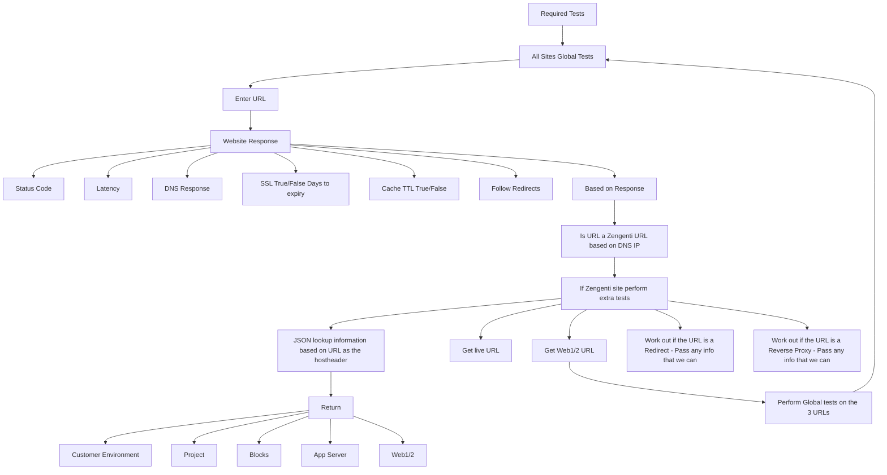

# Mage

Notes at <https://nickilby.github.io/jim-bob/>.

1. Clone the repository:
    ```
    git clone <repository_url>
    ```

2. Create the development virtual environment:
    ```
    make venv-dev
    ```

3. Run the application:
    ```
    make flask
    ```

## Usage

Open your web browser and go to `http://127.0.0.1:5000`.
Enter the URL you want to check in the provided input box and click "Check".

#### Flow of tests


