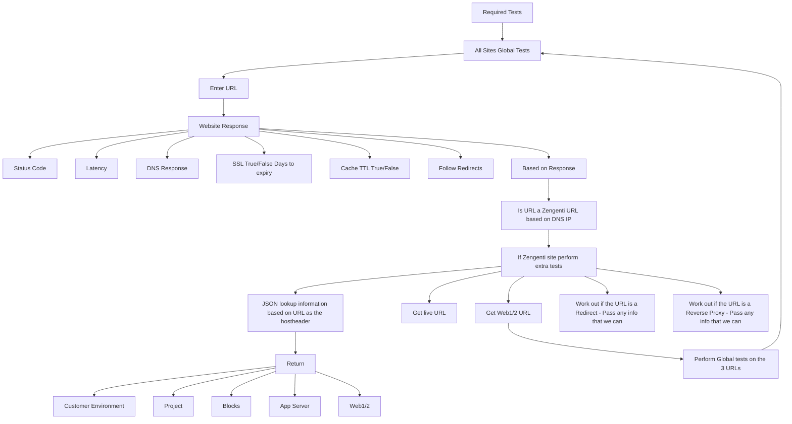

# Tests

1. **DNS Resolution**
   - Verify that the domain name resolves correctly.

2. **HTTP Response Codes**
   - Check the HTTP status codes returned by the server.

3. **Returned Headers**
   - Analyse the headers returned by the server.

4. **Zengenti Site Verification**
   - Verify if the site is hosted by Zengenti.

5. **Client/Environment/Project Discovery**
   - Identify the project and environment associated with the URL.

6. **Customer-Specific Tests**
   - Conduct tests on internal URLs associated with the customer project.
   - **Examples:**
     - External URL: [https://www.lse.ac.uk/](https://www.lse.ac.uk/)
     - Internal project URL: [https://live-else.cloud.contensis.com/](https://live-else.cloud.contensis.com/)
     - Internal server URLs:
       - [https://z-else-web1-live-else.cloud.contensis.com/](https://z-else-web1-live-else.cloud.contensis.com/)
       - [https://z-else-web2-live-else.cloud.contensis.com/](https://z-else-web2-live-else.cloud.contensis.com/)
   - Perform the same DNS and HTTP response code checks on

## Flow of tests

